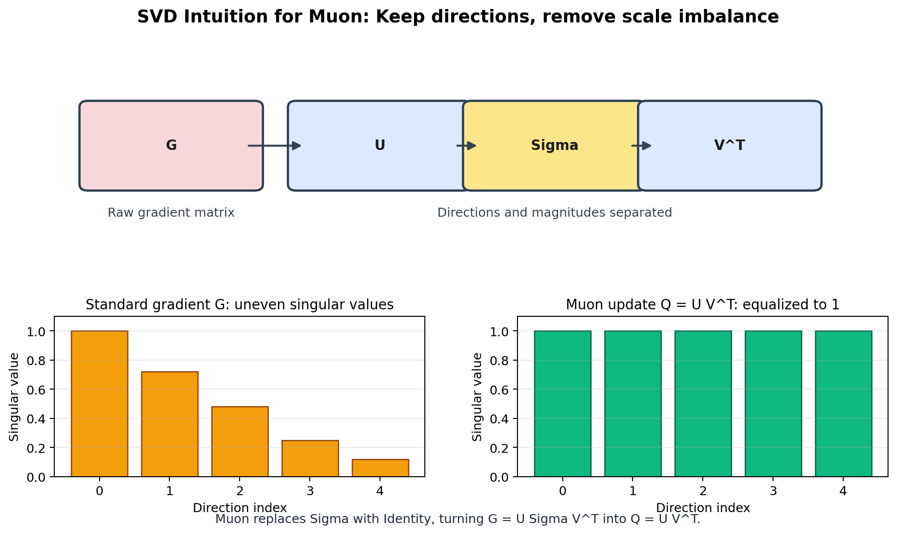
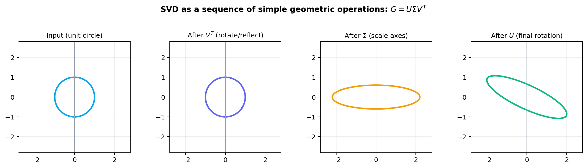
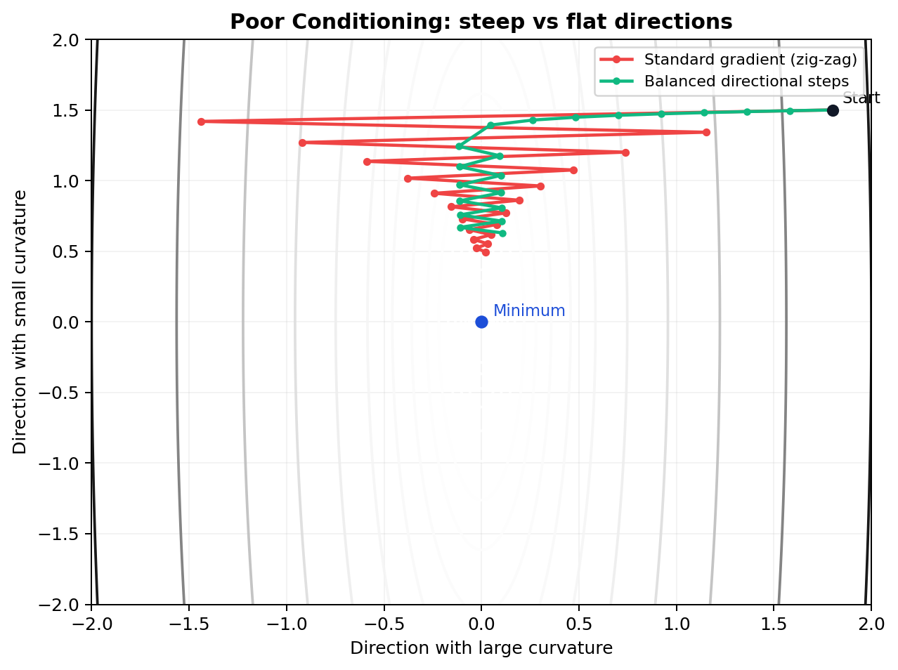
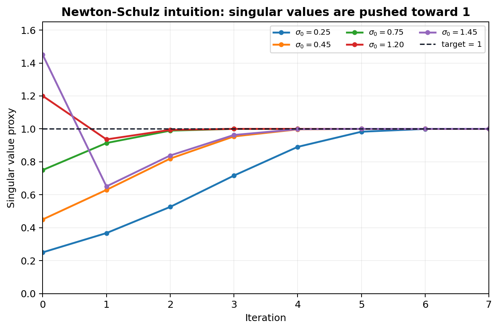

# MODULE 3.5: SVD for the Muon Optimizer – What You Need to Know



*Figure: Muon keeps the SVD directions ($U, V^T$) and removes scale imbalance by replacing $\Sigma$ with identity.*

## Introduction

When studying the Muon optimizer, you will frequently encounter the **Singular Value Decomposition (SVD)**. While SVD is a deep topic in linear algebra, you don't need a PhD in math to understand how Muon works. 

This lesson covers *exactly* what you need to know about SVD to grasp why Muon converges so fast, and why we can't just use standard SVD in PyTorch to run it.

## 1. The Intuition of SVD

Every matrix (like a weight gradient $G$ in a neural network) can be thought of as applying a geometric transformation to a space. SVD states that *any* matrix $G$ can be broken down into three simpler steps:

$$
G = U \Sigma V^T
$$

1. **$V^T$**: A rotation (or reflection) of the input space.
2. **$\Sigma$**: A scaling step. This is a diagonal matrix containing the **singular values** ($\sigma_1, \sigma_2, \dots$). It stretches or squishes the space along the new axes.
3. **$U$**: Another rotation into the output space.

**Key Idea**: The singular values ($\Sigma$) tell us the "magnitude" or "steepness" of the gradient in different orthogonal directions. $U$ and $V^T$ tell us what those directions actually are.



*Figure: SVD decomposes one complex transformation into rotate/reflect, axis scaling, and rotate again.*

## 2. The Problem with Standard Gradients

In standard Gradient Descent or Adam, we update our weights using the raw gradient matrix $G$.

Because standard gradient updates are proportional to the raw matrix $G = U \Sigma V^T$, the update size in each direction depends on its singular value $\sigma_i$. 

- Directions with **large singular values** get massive updates.
- Directions with **small singular values** get tiny, slow updates.

This causes a problem known as poor conditioning. The optimizer spends all of its energy bouncing back and forth along the "steep" directions (large $\sigma$), while making agonizingly slow progress along the flat directions (small $\sigma$).



*Figure: With poor conditioning, raw gradients zig-zag along steep axes, while balanced directional updates move more directly toward the minimum.*

## 3. The Muon Solution: Equalizing the Singular Values

What if we could update the weights in the correct *directions* ($U$ and $V^T$), but treat every direction with equal importance? 

Mathematically, we could just replace the scaling matrix $\Sigma$ with the Identity matrix $I$ (where all values on the diagonal are exactly 1). 

If we do this, the update matrix becomes:

$$
\Delta = U I V^T = U V^T
$$

The matrix $Q = U V^T$ is known as the **orthogonal polar factor** of $G$. 
- It preserves all the directional information of the gradient.
- It completely removes the scaling imbalances. Every orthogonal dimension gets updated with exactly the same magnitude.

This is fundamentally why Muon uses orthogonalized updates: it forces the network to learn equally fast in all directions, dramatically improving convergence speed across the loss landscape.

## 4. Why Not Just Run `torch.linalg.svd()`?

To get $U V^T$, the naive approach is to simply calculate the exact SVD of the momentum/gradient matrix during training:

```python
# Naive (and too slow) approach
U, S, Vt = torch.linalg.svd(G, full_matrices=False)
update_matrix = U @ Vt
```

**The Catch**: Computing the exact SVD is extremely computationally intensive. The time complexity is $\mathcal{O}(m n^2)$, where $m$ and $n$ are the dimensions of the weight matrix. 

For a standard large language model layer (e.g., a $4096 \times 4096$ projection matrix), forcing the CPU/GPU to compute the exact SVD on every single forward-backward pass would be so slow that any step-wise convergence benefits would be completely erased by massive wall-clock training times. 

## 5. Newton-Schulz to the Rescue

We need $U V^T$, but we can't afford the time it takes to compute $U$, $\Sigma$, and $V^T$ individually.

This is where the **Newton-Schulz iteration** comes in (which is covered in detail in Module 6). Newton-Schulz is an iterative mathematical algorithm that takes the matrix $G$ and effectively "squashes" its singular values $\Sigma$ towards 1 using nothing but a series of fast matrix multiplications. 

After a few brief iterations (usually just 5 or 6), it outputs a matrix that is extremely close to $U V^T$. 
- **No SVD computation needed.**
- **Relies purely on highly parallelizable matrix multiplications.**
- **Extremely hardware-friendly for GPU Tensor Cores.**



*Figure: Newton-Schulz-style iterations repeatedly squash singular values toward 1, approximating the $UV^T$ behavior Muon needs.*

## Summary Cheat Sheet

- **$G = U \Sigma V^T$**: The standard gradient, containing directions ($U, V^T$) and magnitudes ($\Sigma$).
- **The Problem**: Raw gradients prioritize directions with large magnitudes, leading to slow training on flat dimensions.
- **The Ideal Update**: $U V^T$. This treats all directions equally (setting all $\sigma_i = 1$).
- **The Obstacle**: Exact SVD is far too slow for large neural networks.
- **The Muon Innovation**: Use Newton-Schulz iterations to cheaply and quickly approximate $U V^T$ using only matrix multiplications.
