# Full Course: The Muon Optimizer

---

# Table of Contents

1. **Module 1: Prerequisites & Background**
2. **Module 2: Motivation — Why We Need Muon**
3. **Module 3: Mathematical Foundations** (incl. **3.5 SVD Intuition**)
4. **Module 4: The Muon Algorithm — Step by Step**
5. **Module 5: Implementation from Scratch**
6. **Module 6: Newton-Schulz Iterations — Deep Dive**
7. **Module 7: Practical Usage & Hyperparameter Tuning**
8. **Module 8: Muon vs Other Optimizers**
9. **Module 9: Distributed / Multi-GPU Muon**
10. **Module 10: Advanced Topics & Current Research**
11. **Appendix A: Quick Reference Card**
12. **Appendix B: Exercises**
13. **Appendix C: FAQ**

---

# MODULE 1: Prerequisites & Background

This course contains deep explanations of Muon optimizer and performing AI research with it.

## 1.1 What is Muon?

Recently there is a new best optimizer in the town - **Muon** (**M**oment**U**m **O**rthogonalized by **N**ewton-schulz).

It train transformers and neural networks faster than Adam/AdamW.

To understand why Muon is so effective, it's helpful to remember what a weight matrix actually does. A matrix acts as a mathematical transformation that takes an input vector and rotates, scales, or shears it to produce an output vector:

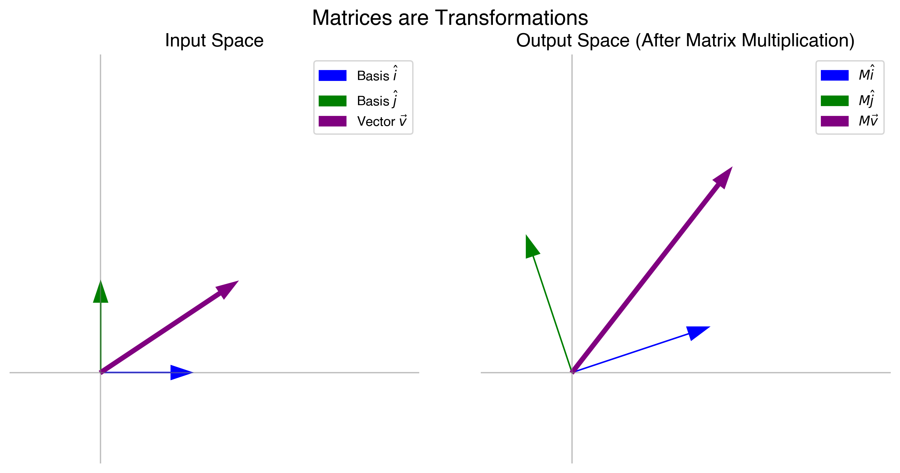

This is weight update rule:

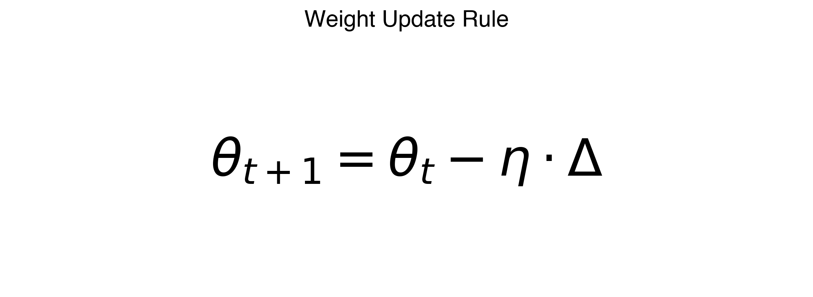

This is weight update matrix:

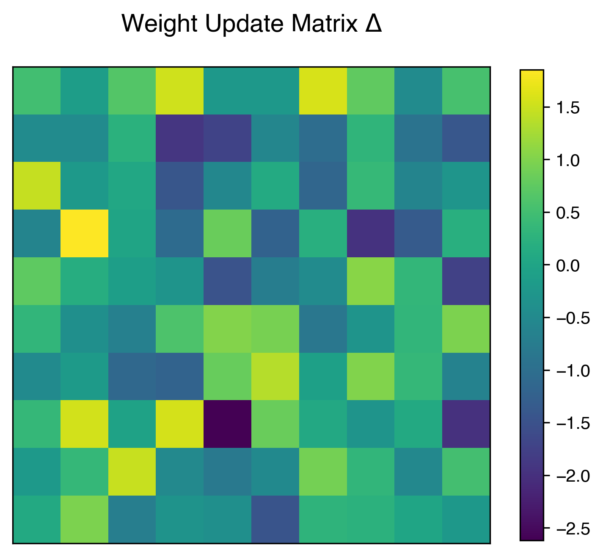

This is what happens if weight update matrix is not orthogonal:


This is what happens if weight update matrix is orthogonal:


Muon orthogonalizes the weight update matrices, Muon ensures that all directions "pull" with equal strength. This overcomes a common flaw in standard optimizers where certain directions are neglected simply because their numeric gradients are small, forcing the network to learn efficiently across the entire parameter space.

**Core idea in one sentence:**
> Take the Nesterov momentum buffer, then orthogonalize it via an approximate polar decomposition (computed cheaply using Newton-Schulz iterations), and use that as the update.

## 1.2 Prerequisites You Should Know

Before diving in, make sure you understand:

### 1.2.1 Gradient Descent

$$
\theta_{t+1} = \theta_t - \eta \cdot \nabla L(\theta_t)
$$

The simplest optimization: move parameters in the direction of steepest descent.

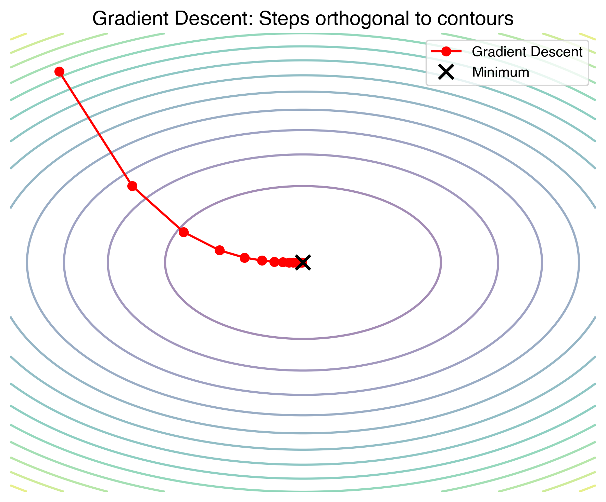

### 1.2.2 Momentum (Polyak / Heavy Ball)

$$
\begin{aligned}
m_{t+1} &= \beta \cdot m_t + \nabla L(\theta_t) \\
\theta_{t+1} &= \theta_t - \eta \cdot m_{t+1}
\end{aligned}
$$

Momentum accumulates past gradients to accelerate training and dampen oscillations.

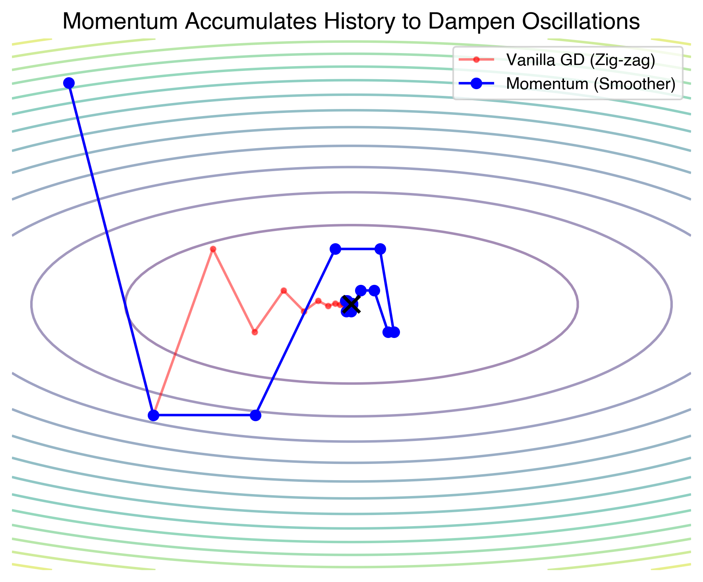

### 1.2.3 Nesterov Accelerated Gradient (NAG)

$$
\begin{aligned}
m_{t+1} &= \beta \cdot m_t + \nabla L(\theta_t - \eta \cdot \beta \cdot m_t) \quad \text{\# "look-ahead" gradient} \\
\theta_{t+1} &= \theta_t - \eta \cdot m_{t+1}
\end{aligned}
$$

Or equivalently (the form Muon uses):
$$
\begin{aligned}
m_{t+1} &= \beta \cdot m_t + \nabla L(\theta_t) \\
\theta_{t+1} &= \theta_t - \eta \cdot (\beta \cdot m_{t+1} + \nabla L(\theta_t)) \quad \text{\# Nesterov extrapolation}
\end{aligned}
$$

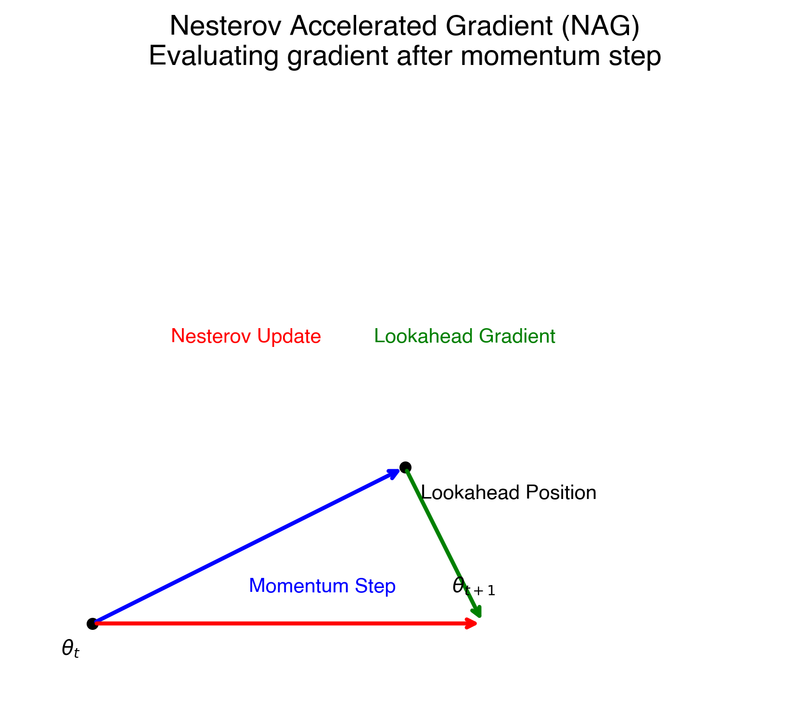

### 1.2.4 Adam / AdamW

$$
\begin{aligned}
m_t &= \beta_1 \cdot m_{t-1} + (1 - \beta_1) \cdot g_t \quad &\text{\# first moment} \\
v_t &= \beta_2 \cdot v_{t-1} + (1 - \beta_2) \cdot g_t^2 \quad &\text{\# second moment} \\
\hat{m}_t &= m_t / (1 - \beta_1^t) \quad &\text{\# bias correction} \\
\hat{v}_t &= v_t / (1 - \beta_2^t) \\
\theta_t &= \theta_{t-1} - \eta \cdot \hat{m}_t / (\sqrt{\hat{v}_t} + \epsilon)
\end{aligned}
$$

Adam is the current default for deep learning. AdamW adds decoupled weight decay.

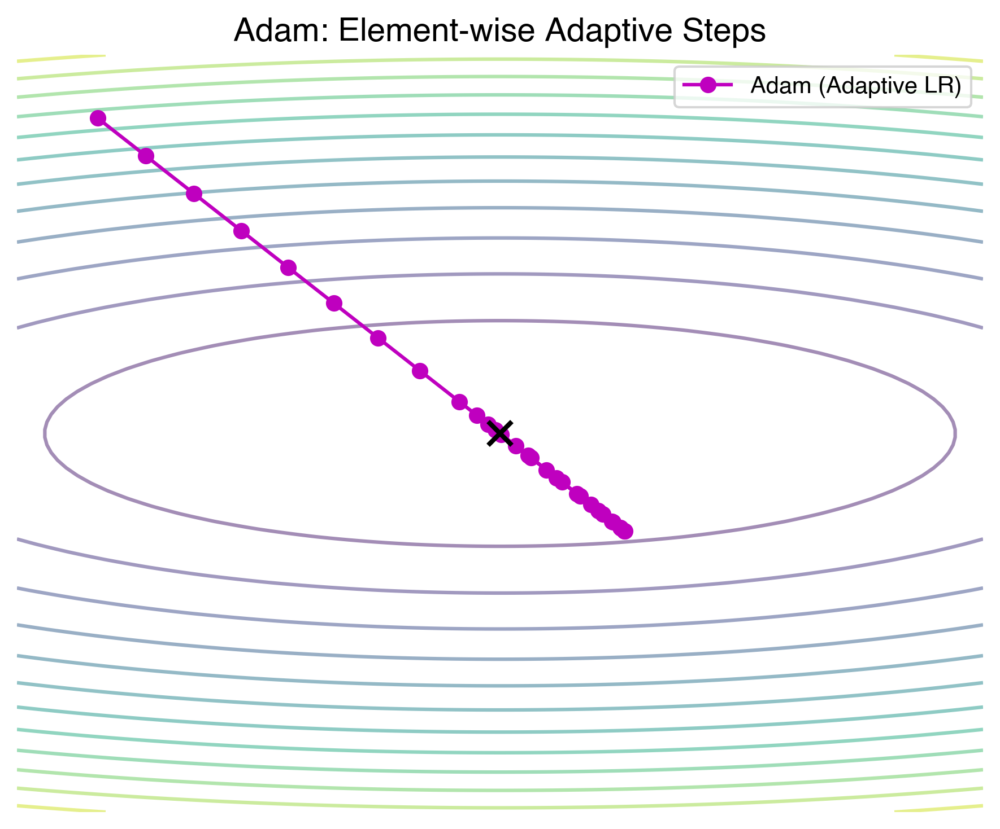

### 1.2.5 Key Linear Algebra Concepts

| Concept | Definition | Why It Matters |
|---------|-----------|----------------|
| **SVD** | $A = U \Sigma V^T$ | Decomposes any matrix into rotations + scaling |
| **Singular Values** | Diagonal of $\Sigma$ | Measure "how much" each direction is stretched |
| **Orthogonal Matrix** | $Q^T Q = Q Q^T = I$ | All singular values = 1 |
| **Spectral Norm** | $\|A\|_2 = \sigma_{\max}(A)$ | Largest singular value |
| **Frobenius Norm** | $\|A\|_F = \sqrt{\sum \sigma_i^2}$ | "Size" of a matrix |
| **Polar Decomposition** | $A = Q \cdot S$ | $Q$ orthogonal, $S$ symmetric positive semi-definite |

### 1.2.6 The Polar Decomposition (Critical for Muon)

Any matrix **G** with shape $m \times n$ (where $m \ge n$) can be decomposed as:

$$
\begin{aligned}
G &= U \Sigma V^T \quad \text{(SVD)} \\
  &= (U V^T)(V \Sigma V^T) \\
  &= Q \cdot S \quad \text{(Polar Decomposition)}
\end{aligned}
$$

Where:
- **$Q = U V^T$** is the **orthogonal polar factor** (the "direction" of $G$)
- **$S = V \Sigma V^T$** is symmetric positive semi-definite (the "magnitude")

**The orthogonal polar factor $Q$ is the closest orthogonal matrix to $G$** (in Frobenius norm).

This is the key object Muon computes.

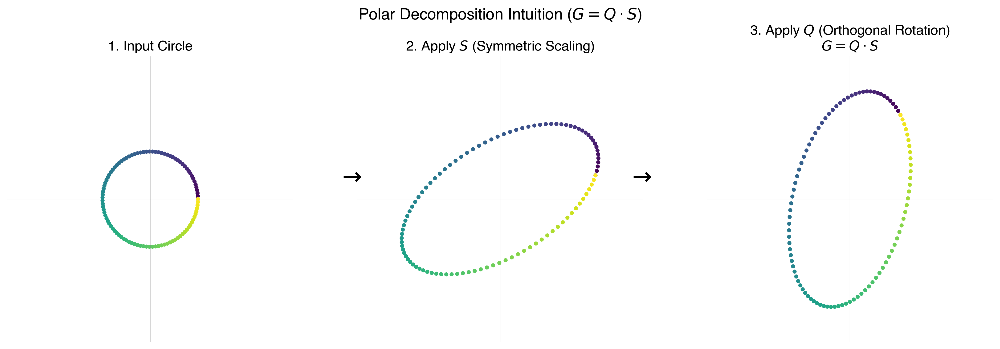

---


---

# MODULE 2: Motivation — Why We Need Muon

## 2.1 The Problem with Adam

Adam works element-wise. Each parameter gets its own adaptive learning rate via the second moment estimate `v_t`. But this means:

1. **It ignores correlations between parameters** — it treats each weight independently
2. **Memory cost** — it stores two state tensors (m and v) per parameter: **2× the model size**
3. **It's solving a "diagonal" approximation** to the true natural gradient

## 2.2 The Ideal: Natural Gradient / Second-Order Methods

The **natural gradient** uses the Fisher information matrix F:

$$
\theta_{t+1} = \theta_t - \eta \cdot F^{-1} \cdot \nabla L(\theta_t)
$$

This accounts for the geometry of the parameter space. But F is enormous (parameters² × parameters²) and inverting it is intractable.

## 2.3 The Shampoo / SOAP Connection

**Shampoo** approximates the full preconditioner by maintaining left and right preconditioners:

For a weight matrix W of shape `m × n`:
$$
\begin{aligned}
L_t &= \beta \cdot L_{t-1} + G_t \cdot G_t^T \quad &(m \times m) \\
R_t &= \beta \cdot R_{t-1} + G_t^T \cdot G_t \quad &(n \times n) \\
\\
\text{Update:} &\quad L_t^{-1/4} \cdot G_t \cdot R_t^{-1/4}
\end{aligned}
$$

**SOAP** (from Meta) modernized Shampoo by running it in the eigenbasis of the preconditioners.

These are powerful but expensive due to the eigendecompositions / matrix inversions.

## 2.4 Muon's Key Insight

Keller Jordan and collaborators realized:

> **If you take the Shampoo preconditioned gradient and look at what it does in the limit of large batch / infinite data, it converges to the polar decomposition of the gradient.**

In other words, the "ideal" Shampoo update direction is just the **orthogonal polar factor** of the gradient.

**Why?** Because:
- Shampoo's preconditioner `L^{-1/4} G R^{-1/4}` normalizes the singular values of G
- In the limit, all singular values become 1
- A matrix with all singular values = 1 is exactly the orthogonal polar factor

So instead of building expensive preconditioners, **just compute the polar decomposition directly!**

## 2.5 Steepest Descent Under the Spectral Norm

There's another beautiful way to motivate Muon. Consider the general optimization step:

$$
\theta_{t+1} = \theta_t - \eta \cdot \operatorname*{argmax}_{\|\Delta\| \le 1} \langle \nabla L, \Delta \rangle
$$

This asks: "what unit-norm direction gives the most decrease in loss?"

The answer depends on the norm:

| Norm | Steepest Descent Direction | Result |
|------|---------------------------|---------|
| L2 (Frobenius) | $G / \|G\|_F$ | Standard gradient descent |
| L$\infty$ (element-wise) | $\text{sign}(G)$ | SignSGD |
| **Spectral (operator) norm** | **Orthogonal polar factor of G** | **Muon** |

**Muon performs steepest descent under the spectral norm!**

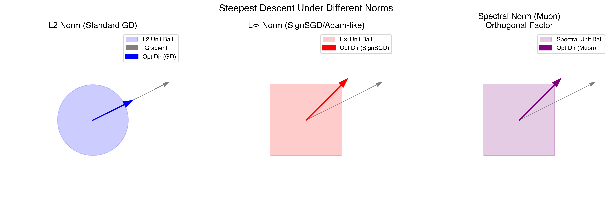

This is ideal for weight matrices because:
- It treats the matrix as a **linear operator**, not a bag of independent numbers
- It pushes **all singular values equally**, preventing some directions from being neglected
- It naturally respects the structure of matrix multiplication

## 2.6 Practical Results

On the `modded-nanogpt` speedrun (GPT-2 124M on OpenWebText):
- **Adam baseline**: ~3.28 validation loss in 10K steps
- **Muon**: reaches the same loss in **~5K steps** (roughly 2× fewer steps)
- Wall-clock time is also faster due to simpler computation


---


---

# MODULE 3: Mathematical Foundations


## MODULE 3.5: SVD for the Muon Optimizer – What You Need to Know

## Introduction

When studying the Muon optimizer, you will frequently encounter the **Singular Value Decomposition (SVD)**. While SVD is a deep topic in linear algebra, you don't need a PhD in math to understand how Muon works. 

This lesson covers *exactly* what you need to know about SVD to grasp why Muon converges so fast, and why we can't just use standard SVD in PyTorch to run it.

## 1. The Intuition of SVD

Every matrix (like a weight gradient $G$ in a neural network) can be thought of as applying a geometric transformation to a space. SVD states that *any* matrix $G$ can be broken down into three simpler steps:

$$
G = U \Sigma V^T
$$

1. **$V^T$**: A rotation (or reflection) of the input space.
2. **$\Sigma$**: A scaling step. This is a diagonal matrix containing the **singular values** ($\sigma_1, \sigma_2, \dots$). It stretches or squishes the space along the new axes.
3. **$U$**: Another rotation into the output space.

**Key Idea**: The singular values ($\Sigma$) tell us the "magnitude" or "steepness" of the gradient in different orthogonal directions. $U$ and $V^T$ tell us what those directions actually are.


*Figure: SVD decomposes one complex transformation into rotate/reflect, axis scaling, and rotate again.*

## 2. The Problem with Standard Gradients

In standard Gradient Descent or Adam, we update our weights using the raw gradient matrix $G$.

Because standard gradient updates are proportional to the raw matrix $G = U \Sigma V^T$, the update size in each direction depends on its singular value $\sigma_i$. 

- Directions with **large singular values** get massive updates.
- Directions with **small singular values** get tiny, slow updates.

This causes a problem known as poor conditioning. The optimizer spends all of its energy bouncing back and forth along the "steep" directions (large $\sigma$), while making agonizingly slow progress along the flat directions (small $\sigma$).


*Figure: With poor conditioning, raw gradients zig-zag along steep axes, while balanced directional updates move more directly toward the minimum.*

## 3. The Muon Solution: Equalizing the Singular Values

What if we could update the weights in the correct *directions* ($U$ and $V^T$), but treat every direction with equal importance? 

Mathematically, we could just replace the scaling matrix $\Sigma$ with the Identity matrix $I$ (where all values on the diagonal are exactly 1). 

If we do this, the update matrix becomes:

$$
\Delta = U I V^T = U V^T
$$

The matrix $Q = U V^T$ is known as the **orthogonal polar factor** of $G$. 
- It preserves all the directional information of the gradient.
- It completely removes the scaling imbalances. Every orthogonal dimension gets updated with exactly the same magnitude.

This is fundamentally why Muon uses orthogonalized updates: it forces the network to learn equally fast in all directions, dramatically improving convergence speed across the loss landscape.

## 4. Why Not Just Run `torch.linalg.svd()`?

To get $U V^T$, the naive approach is to simply calculate the exact SVD of the momentum/gradient matrix during training:

```python
# Naive (and too slow) approach
U, S, Vt = torch.linalg.svd(G, full_matrices=False)
update_matrix = U @ Vt
```

**The Catch**: Computing the exact SVD is extremely computationally intensive. The time complexity is $\mathcal{O}(m n^2)$, where $m$ and $n$ are the dimensions of the weight matrix. 

For a standard large language model layer (e.g., a $4096 \times 4096$ projection matrix), forcing the CPU/GPU to compute the exact SVD on every single forward-backward pass would be so slow that any step-wise convergence benefits would be completely erased by massive wall-clock training times. 

## 5. Newton-Schulz to the Rescue

We need $U V^T$, but we can't afford the time it takes to compute $U$, $\Sigma$, and $V^T$ individually.

This is where the **Newton-Schulz iteration** comes in (which is covered in detail in Module 6). Newton-Schulz is an iterative mathematical algorithm that takes the matrix $G$ and effectively "squashes" its singular values $\Sigma$ towards 1 using nothing but a series of fast matrix multiplications. 

After a few brief iterations (usually just 5 or 6), it outputs a matrix that is extremely close to $U V^T$. 
- **No SVD computation needed.**
- **Relies purely on highly parallelizable matrix multiplications.**
- **Extremely hardware-friendly for GPU Tensor Cores.**


*Figure: Newton-Schulz-style iterations repeatedly squash singular values toward 1, approximating the $UV^T$ behavior Muon needs.*

## Summary Cheat Sheet

- **$G = U \Sigma V^T$**: The standard gradient, containing directions ($U, V^T$) and magnitudes ($\Sigma$).
- **The Problem**: Raw gradients prioritize directions with large magnitudes, leading to slow training on flat dimensions.
- **The Ideal Update**: $U V^T$. This treats all directions equally (setting all $\sigma_i = 1$).
- **The Obstacle**: Exact SVD is far too slow for large neural networks.
---

## 3.6 Singular Value Decomposition (SVD) — Review

For any matrix $G \in \mathbb{R}^{m \times n}$ with $m \ge n$:

$$
G = U \Sigma V^T
$$

Where:
- $U \in \mathbb{R}^{m \times m}$ is orthogonal (left singular vectors)
- $\Sigma \in \mathbb{R}^{m \times n}$ has singular values $\sigma_1 \ge \sigma_2 \ge \dots \ge \sigma_n \ge 0$ on the diagonal
- $V \in \mathbb{R}^{n \times n}$ is orthogonal (right singular vectors)

## 3.7 Polar Decomposition — Formal Treatment

### Definition

For $G \in \mathbb{R}^{m \times n}$ ($m \ge n$) of full rank:

$$
G = Q \cdot P
$$

Where:
- $Q \in \mathbb{R}^{m \times n}$ is a **partial isometry** ($Q^T Q = I_n$)
- $P \in \mathbb{R}^{n \times n}$ is **symmetric positive definite**

### Relation to SVD

$$
\begin{aligned}
Q &= U V^T \quad &\text{(the orthogonal polar factor)} \\
P &= V \Sigma V^T \quad &\text{(the positive semi-definite factor)}
\end{aligned}
$$

### Key Property

**$Q$ is the nearest orthogonal matrix to $G$:**

$$
Q = \operatorname*{argmin}_{Z: Z^TZ = I} \|G - Z\|_F
$$

This can also be written as:

$$
Q = G (G^TG)^{-1/2}
$$

## 3.8 Why Orthogonal Updates?

Consider a weight matrix $W \in \mathbb{R}^{m \times n}$ in a neural network. When we update:

$$
W_{t+1} = W_t - \eta \cdot \Delta
$$

If $\Delta$ is the orthogonal polar factor of the gradient:
- **All directions get equal treatment**: $\sigma_i(\Delta) = 1$ for all $i$
- **No "rich get richer" problem**: unlike raw gradients where large singular value directions dominate
- **Scale-free updates**: the update magnitude is determined by $\eta$ alone, not by gradient magnitude

## 3.9 Steepest Descent — Formal Proof

**Theorem**: Let $G \in \mathbb{R}^{m \times n}$ have SVD $G = U\Sigma V^T$. Then:

$$
\operatorname*{argmax}_{\|\Delta\|_2 \le 1} \langle G, \Delta \rangle_F = UV^T
$$

where $\|\cdot\|_2$ is the spectral (operator) norm and $\langle \cdot,\cdot \rangle_F$ is the Frobenius inner product (trace inner product).

**Proof**:

$$
\langle G, \Delta \rangle_F = \text{tr}(G^T\Delta) = \text{tr}(V\Sigma U^T\Delta)
$$

Let $M = U^T\Delta V$, so $\Delta = UMV^T$. Since $\|\Delta\|_2 \le 1$, we have $\|M\|_2 \le 1$ (singular values of $M \le 1$).

$$
\text{tr}(V\Sigma U^T \cdot UMV^T) = \text{tr}(V\Sigma MV^T) = \text{tr}(\Sigma M) = \sum_i \sigma_i m_{ii}
$$

This is maximized when all $m_{ii} = 1$, i.e., $M = I$, giving:

$$
\Delta^* = UIV^T = UV^T
$$

This is the orthogonal polar factor. ∎

## 3.10 Computing the Polar Factor

Three main approaches:

### 3.5.1 Via SVD (Exact but Expensive)
```python
U, S, Vt = torch.linalg.svd(G, full_matrices=False)
Q = U @ Vt
```
**Cost**: $\mathcal{O}(mn^2)$ for $m \ge n$. Too expensive for every optimization step.

### 3.5.2 Via Matrix Iteration: Newton's Method
The classic iteration for computing `sign(A)` or the polar factor:

$$
\begin{aligned}
X_0 &= G / \|G\| \\
X_{k+1} &= \frac{3}{2} X_k - \frac{1}{2} X_k X_k^T X_k \quad \text{(for thin matrices)}
\end{aligned}
$$

This converges quadratically to the polar factor Q. Each iteration is a matrix multiply.

### 3.5.3 Via Newton-Schulz Iterations (What Muon Uses)
Higher-order variants that converge faster in fewer iterations. Muon uses a **quintic** (5th order) variant. We'll cover this in detail in Module 6.

---


---

# MODULE 4: The Muon Algorithm — Step by Step

## 4.1 The Algorithm

Here's the complete Muon algorithm:

$$
\begin{aligned}
&\textbf{Algorithm: Muon Optimizer} \\
&\rule{10cm}{0.4pt} \\
&\textbf{Input: } \text{learning rate } \eta, \text{ momentum } \beta, \text{ weight decay } \lambda, \text{ Newton-Schulz steps } K, \text{ parameters } \theta_0 \\
&\textbf{Initialize: } \text{momentum buffer } m_0 = 0 \\
\\
&\textbf{For } t = 1, 2, 3, \dots: \\
&\quad \textbf{1. Compute gradient: } g_t = \nabla L(\theta_t) \\
\\
&\quad \textbf{2. Nesterov momentum:} \\
&\qquad m_t = \beta \cdot m_{t-1} + g_t \\
&\qquad n_t = \beta \cdot m_t + g_t \qquad \text{(\# Nesterov "look-ahead")} \\
\\
&\quad \textbf{3. Orthogonalize via Newton-Schulz:} \\
&\qquad \textbf{If } \theta \text{ is a 2D+ weight matrix:} \\
&\qquad \quad \text{Reshape } n_t \text{ to 2D (if needed)} \\
&\qquad \quad \text{Ensure rows } \ge \text{cols (transpose if needed)} \\
&\qquad \quad Q_t = \text{NewtonSchulz}(n_t, K \text{ steps}) \\
&\qquad \quad \text{Reshape } Q_t \text{ back to original shape} \\
&\qquad \textbf{Else:} \\
&\qquad \quad \text{(Use a different optimizer like Adam for 1D params)} \\
\\
&\quad \textbf{4. Update with weight decay:} \\
&\qquad \theta_{t+1} = (1 - \eta \cdot \lambda) \cdot \theta_t - \eta \cdot Q_t \\
&\rule{10cm}{0.4pt}
\end{aligned}
$$

## 4.2 Step-by-Step Walkthrough

Let's trace through one step for a weight matrix W of shape (768, 512):

### Step 1: Gradient
```python
g = torch.autograd.grad(L, W)  # shape: (768, 512)
```

### Step 2: Nesterov Momentum
```
m = 0.95 * m_prev + g          # accumulate momentum
nesterov = 0.95 * m + g        # look-ahead estimate
```

The Nesterov term combines the current momentum with the current gradient to get a "preview" of where momentum is heading.

### Step 3: Orthogonalize
```python
# nesterov has shape (768, 512), already rows >= cols ✓
# Normalize:
X = nesterov / (torch.linalg.norm(nesterov) + eps) * math.sqrt(768)    # scale for numerical stability

# Apply K=5 Newton-Schulz iterations:
for i in range(5):
    A = X @ X.T                  # (768, 768)
    X = a*X + b*(A @ X) + c*(A @ A @ X)  # quintic update

# Result: X is approximately orthogonal polar factor of nesterov
Q = X                           # shape: (768, 512)
```

### Step 4: Update
$$
W_{t+1} = (1 - \text{lr} \cdot \text{wd}) \cdot W_t - \text{lr} \cdot Q_t
$$

## 4.3 Why Nesterov Momentum?

Muon applies Nesterov momentum **before** the orthogonalization step. This is important:

1. **Momentum accumulates gradient history** — gives a better signal than a single noisy gradient
2. **Nesterov specifically** provides a "lookahead" that is empirically better than Polyak momentum
3. **Orthogonalizing the momentum buffer** (not the raw gradient) means we're orthogonalizing a smoother, more reliable signal

## 4.4 What Happens to Different Parameter Types?

Muon is designed for **2D weight matrices**. Other parameters need different treatment:

| Parameter Type | Shape | Optimizer |
|---------------|-------|-----------|
| Linear weights | (out, in) | **Muon** ✓ |
| Conv weights | (out, in, k, k) | **Muon** (reshape to 2D) ✓ |
| Embedding weights | (vocab, dim) | Adam/AdamW |
| LayerNorm scale | (dim,) | Adam/AdamW |
| Biases | (dim,) | Adam/AdamW |
| Final LM head | (vocab, dim) | Adam/AdamW |

The embedding and final head are typically excluded because:
- They deal with the vocabulary dimension which is "discrete"
- Their gradients have very different structure (often very sparse)

## 4.5 The Role of Weight Decay

Weight decay in Muon is **decoupled** (like AdamW), applied directly to the parameters:

$$
W_{t+1} = (1 - \text{lr} \cdot \text{wd}) \cdot W_t - \text{lr} \cdot Q_t
$$

This shrinks the weights independently of the gradient-based update. Typical values are small (e.g., 0.01 to 0.1).

---


---

# MODULE 5: Implementation from Scratch

## 5.1 Minimal Muon Implementation

```python
import torch
from torch.optim import Optimizer
import torch.distributed as dist


def newton_schulz_5(G, steps=5):
    
    # Quintic polynomial coefficients (optimized for convergence)
    # These are tuned so the combined iteration converges over 
    # the singular value range [0.6, 1.4] in ~5 steps
    a, b, c = (3.4445, -4.7750,  2.0315)
    # Alternative coefficients for later iterations:
    # (11.3168, -20.3300, 9.7132)  
    # (8.4749,  -13.9590, 6.1843)
    
    # Normalize: scale so Frobenius norm ≈ sqrt(nrows)
    # This puts singular values near 1
    X = G / (G.norm() + 1e-7) * (G.shape[0] ** 0.5)
    
    # Transpose if needed to make it "tall-skinny" for efficiency
    if G.shape[0] < G.shape[1]:
        X = X.T
    
    for _ in range(steps):
        A = X @ X.T                           # (m, m)
        B = A @ X                             # (m, n) = A @ X
        X = a * X + b * B + c * (A @ B)      # quintic update
    
    if G.shape[0] < G.shape[1]:
        X = X.T
    
    return X


class Muon(Optimizer):
    """
    Muon - MomentUm Orthogonalized by Newton-schulz
    
    For use on 2D weight matrices. Should be combined with
    a separate optimizer (e.g., AdamW) for 1D parameters.
    
    Args:
        params: Parameters to optimize (should be 2D weight matrices)
        lr: Learning rate (default: 0.02)
        momentum: Nesterov momentum coefficient (default: 0.95)
        weight_decay: Decoupled weight decay (default: 0.0)
        ns_steps: Number of Newton-Schulz iterations (default: 5)
    """
    
    def __init__(self, params, lr=0.02, momentum=0.95, 
                 weight_decay=0.0, ns_steps=5):
        defaults = dict(
            lr=lr, 
            momentum=momentum, 
            weight_decay=weight_decay,
            ns_steps=ns_steps
        )
        super().__init__(params, defaults)
    
    @torch.no_grad()
    def step(self, closure=None):
        loss = None
        if closure is not None:
            with torch.enable_grad():
                loss = closure()
        
        for group in self.param_groups:
            lr = group['lr']
            momentum = group['momentum']
            wd = group['weight_decay']
            ns_steps = group['ns_steps']
            
            for p in group['params']:
                if p.grad is None:
                    continue
                
                g = p.grad
                state = self.state[p]
                
                # ---- State initialization ----
                if len(state) == 0:
                    state['step'] = 0
                    state['momentum_buffer'] = torch.zeros_like(g)
                
                state['step'] += 1
                buf = state['momentum_buffer']
                
                # ---- Nesterov momentum ----
                buf.mul_(momentum).add_(g)
                nesterov = buf * momentum + g
                # nesterov = momentum * (momentum * buf_old + g) + g
                # This is the standard Nesterov formulation
                
                # ---- Reshape to 2D if necessary ----
                original_shape = nesterov.shape
                if nesterov.dim() > 2:
                    nesterov = nesterov.view(nesterov.shape[0], -1)
                
                # Ensure rows >= cols
                transposed = False
                if nesterov.shape[0] < nesterov.shape[1]:
                    nesterov = nesterov.T
                    transposed = True
                
                # ---- Newton-Schulz orthogonalization ----
                Q = newton_schulz_5(nesterov, steps=ns_steps)
                
                # ---- Undo transpose if applied ----
                if transposed:
                    Q = Q.T
                
                # ---- Reshape back ----
                Q = Q.view(original_shape)
                
                # ---- Apply update with weight decay ----
                p.mul_(1 - lr * wd)
                p.add_(Q, alpha=-lr)
        
        return loss
```

## 5.2 Usage Example

```python
# 1. Group parameters
muon_params = [p for n, p in model.named_parameters() if p.dim() >= 2 and 'embed' not in n]
adam_params = [p for n, p in model.named_parameters() if p.dim() < 2 or 'embed' in n]

# 2. Initialize optimizers
opt1 = Muon(muon_params, lr=0.02, momentum=0.95)
opt2 = torch.optim.AdamW(adam_params, lr=3e-4)

# 3. Step both in training loop
loss.backward()
opt1.step()
opt2.step()
opt1.zero_grad()
opt2.zero_grad()
```

---


---

# MODULE 6: Newton-Schulz Iterations — Deep Dive

## 6.1 The Core Mathematical Problem

Given a matrix $G \in \mathbb{R}^{m \times n}$, compute:

$$
Q = U V^T \quad \text{(orthogonal polar factor)}
$$

where $G = U \Sigma V^T$ is the SVD. Direct SVD costs $\mathcal{O}(mn^2)$, which is too expensive for every optimizer step.

## 6.2 Classical Newton Iteration for Polar Decomposition

The standard Newton iteration:

$$
\begin{aligned}
X_0 &= G / \|G\|_2 \\
X_{k+1} &= \frac{1}{2}(X_k + X_k^{-T}) \quad \text{(for square matrices)}
\end{aligned}
$$

This converges quadratically but requires matrix inversion.

For rectangular matrices, we use the equivalent:

$$
X_{k+1} = \frac{1}{2}(3X_k - X_k X_k^T X_k)
$$

This is inversion-free and only requires matrix multiplications!

## 6.3 Understanding the Iteration as a Scalar Function

The key insight: the Newton-Schulz iteration acts **independently on each singular value**.

If $G = U \Sigma V^T$, then at each step, each singular value $\sigma_i$ is mapped by a scalar function:

$$
\sigma_i \to f(\sigma_i)
$$

For the cubic iteration $X \leftarrow (3X - X X^T X) / 2$:
$$
f(\sigma) = \frac{3\sigma - \sigma^3}{2}
$$

**Goal**: $f$ should map any positive $\sigma \to 1$ (since the polar factor has all singular values = 1).

Let's check:
- $f(1) = (3 - 1) / 2 = 1$ ✓ (fixed point)
- $f(0.5) = (1.5 - 0.125) / 2 = 0.6875$ (getting closer to 1)
- $f(0.9) = (2.7 - 0.729) / 2 = 0.9855$ (getting closer to 1)

The iteration converges if $\sigma \in (0, \sqrt{3})$, which is ensured by normalization.

## 6.4 The Quintic (5th Order) Variant Used in Muon

Muon uses a **higher-order** polynomial iteration:

$$
X_{k+1} = a \cdot X + b \cdot (X X^T) X + c \cdot (X X^T)^2 X
$$

In terms of scalar singular values:
$$
f(\sigma) = a \cdot \sigma + b \cdot \sigma^3 + c \cdot \sigma^5
$$

This is a **quintic polynomial** that maps singular values toward 1.

### Why quintic?

The higher the degree, the flatter the function near the fixed point $\sigma = 1$, meaning **faster convergence**. Compare:

| Method | Polynomial degree | Convergence order |
|--------|------------------|-------------------|
| Cubic (standard NS) | 3 | Quadratic |
| Quintic (Muon's NS) | 5 | Cubic |
| Septic (possible) | 7 | Quartic |

More specifically, we need:
$$
\begin{aligned}
f(1) &= 1 \quad &\text{(fixed point)} \\
f'(1) &= 0 \quad &\text{(superlinear convergence)} \\
f''(1) &= 0 \quad &\text{(even faster, for the quintic)}
\end{aligned}
$$

From $f(\sigma) = a\sigma + b\sigma^3 + c\sigma^5$:
$$
\begin{aligned}
f(1) &= a + b + c = 1 \\
f'(1) &= a + 3b + 5c = 0 \\
f''(1) &= 6b + 20c = 0
\end{aligned}
$$

This gives: $b = -10c/3$, $a = 1 - b - c = 1 + 10c/3 - c = 1 + 7c/3$.

We still have one free parameter (c) that can be optimized for the convergence rate over a specific range of initial singular values.

## 6.5 Coefficient Optimization

The Muon authors optimized the coefficients to maximize convergence speed over the initial singular value range they expect after normalization.

After normalizing $X_0 = G / \|G\|_F \cdot \sqrt{\text{nrows}}$, the singular values are distributed roughly in $[0.5, 1.5]$.

The optimized coefficient sets:

```python
# First iteration: broad convergence, brings σ from [0.5, 1.5] closer to 1
(3.4445, -4.7750, 2.0315)

# Second iteration: tighter convergence  
(11.3168, -20.3300, 9.7132)

# Third+ iteration: polishing
(8.4749, -13.9590, 6.1843)
```

Let's verify the first set satisfies our constraints:
```python
a + b + c = 3.4445 + (-4.7750) + 2.0315 = 0.701  
# Hmm, not exactly 1! 
```

Wait — the coefficients used in practice don't exactly satisfy $f(1)=1$ because they're numerically optimized over a range, not just at the fixed point. The iteration is designed to converge to a matrix with all singular values = 1 after multiple steps, even if each individual step doesn't exactly preserve $\sigma = 1$.


## 6.7 Computational Cost Analysis

For a matrix $G$ of shape $(m, n)$ with $m \ge n$:

**Per Newton-Schulz iteration:**
```python
A = X @ X.T         # Cost: O(m²n)    → (m, n) × (n, m) = (m, m)
B = A @ X           # Cost: O(m²n)    → (m, m) × (m, n) = (m, n)  
C = A @ B           # Cost: O(m²n)    → (m, m) × (m, n) = (m, n)
X = a*X + b*B + c*C # Cost: O(mn)     → element-wise
```

**Total per iteration**: $\mathcal{O}(m^2 n)$
**Total for $K$ iterations**: $\mathcal{O}(K \cdot m^2 n)$

**Compare to SVD**: $\mathcal{O}(mn^2)$ for $m \ge n$

For a typical linear layer (768, 768):
- NS iteration: $\mathcal{O}(K \times 768^3) \approx 5 \times 4.5 \times 10^8 \approx 2.3 \times 10^9$ FLOPs
- SVD: $\mathcal{O}(768^3) \approx 4.5 \times 10^8$ FLOPs

But! NS iterations are:
1. **GPU-friendly**: just matrix multiplies (highly optimized)
2. **Can use bf16/fp16**: lower precision is fine
3. **Easily parallelizable**: standard GEMM operations

## 6.8 Numerical Considerations

### Normalization Strategy

Before starting NS iterations, we need to normalize G so its singular values are near 1:

```python
# Option 1: Frobenius norm (most common in Muon)
X = G / G.norm()                    # σ_max(X) ≤ 1

# Option 2: Scale to expected norm
X = G / G.norm() * (nrows ** 0.5)   # E[σ²] ≈ 1 for random matrices

# Option 3: Spectral norm estimate
X = G / estimated_spectral_norm(G)
```

Option 2 is what Muon uses. The intuition: for a random matrix of shape $(m, n)$, the Frobenius norm is approximately $\sqrt{mn}$, so dividing by the norm and multiplying by $\sqrt{m}$ makes the average singular value $\approx 1$.

### Precision

Newton-Schulz iterations are numerically stable in **bfloat16**, which is important for:
- Memory efficiency (half the memory of fp32)
- Speed on modern GPUs (tensor cores)

```python
def newton_schulz_bf16(G, steps=5):
    X = G.bfloat16()
    # ... iterations in bf16 ...
    return X.to(G.dtype)
```

## 6.9 Alternative: The "Transposed" Formulation

When m < n (wide matrix), we can either:

1. **Transpose**: Work with $G^T$ (shape $n \times m$, now tall), compute polar factor, transpose back
2. **Use the "right" iteration**: $X_{k+1} = aX + b \cdot X(X^T X) + c \cdot X(X^T X)^2$

Option 1 is simpler and is what Muon does:

```python
transposed = False
if G.shape[0] < G.shape[1]:
    G = G.T
    transposed = True

Q = newton_schulz(G)

if transposed:
    Q = Q.T
```

---


---

# MODULE 7: Practical Usage & Hyperparameter Tuning

## 7.1 Key Hyperparameters

| Hyperparameter | Symbol | Typical Range | Default | Notes |
|---------------|--------|--------------|---------|-------|
| Learning Rate | $\eta$ | 0.005 – 0.05 | 0.02 | Much larger than Adam! |
| Momentum | $\beta$ | 0.85 – 0.99 | 0.95 | Nesterov momentum |
| Weight Decay | $\lambda$ | 0.0 – 0.1 | 0.01 | Decoupled (like AdamW) |
| NS Steps | $K$ | 3 – 10 | 5 | More = more accurate but slower |

## 7.2 Learning Rate

### Why is Muon's LR So Much Higher Than Adam's?

Adam's LR is typically 1e-4 to 1e-3. Muon's is 0.01 to 0.05. Why?

**Adam** divides by $\sqrt{v_t} + \epsilon$, which is roughly the RMS gradient magnitude. For typical neural network gradients, this is ~0.01–0.1, so Adam effectively amplifies the update by 10-100×.

**Muon** uses the polar factor, which has a fixed "magnitude" (all singular values = 1). The Frobenius norm of the update is $\sqrt{\min(m,n)}$. So the effective step size is directly controlled by $\eta$.

### Learning Rate Schedules

Muon works well with standard schedules:

```python
# Cosine decay with warmup
def get_lr(step, warmup_steps=200, max_steps=10000, 
           max_lr=0.02, min_lr=0.002):
    if step < warmup_steps:
        return max_lr * step / warmup_steps
    
    progress = (step - warmup_steps) / (max_steps - warmup_steps)
    return min_lr + 0.5 * (max_lr - min_lr) * (1 + math.cos(math.pi * progress))

# In training loop:
for step in range(max_steps):
    lr = get_lr(step)
    for group in optimizer_muon.param_groups:
        group['lr'] = lr
```

### Different LRs for Muon vs Adam

Typically:
```python
muon_lr = 0.02       # For weight matrices
adam_lr = 3e-4        # For embeddings, layernorms, biases
```

The ratio is roughly 50-100×.

## 7.3 Momentum

**$\beta = 0.95$** is a strong default. Some guidelines:

- **Larger batch → higher momentum** (more stable signal, can leverage more history)
- **Smaller batch → lower momentum** (noisy signal, less history is better)
- **Shorter training → lower momentum** (less time for momentum to build up)

```
Batch size 256:  β ≈ 0.90-0.93
Batch size 512:  β ≈ 0.93-0.95
Batch size 1024: β ≈ 0.95-0.97
```

## 7.4 Weight Decay

Weight decay in Muon is straightforward since it's decoupled:

$$
W \leftarrow (1 - \eta \cdot \lambda) \cdot W - \eta \cdot Q
$$

**Typical values**: 0.0 to 0.05. Start with 0.01.

Note: Since Muon's LR is larger than Adam's, the effective weight decay is also larger. If you're matching an Adam setup with WD=0.1 and LR=3e-4:

```
Adam effective WD per step: 0.1 × 3e-4 = 3e-5
Muon with WD=0.0015 and LR=0.02: 0.0015 × 0.02 = 3e-5  (matched)
```

## 7.5 Newton-Schulz Steps

**$K = 5$** is almost always sufficient. Here's why:

After normalization, singular values are in roughly [0.3, 1.7]. After 5 quintic NS iterations, they converge to within ~0.001 of 1.0.

| $K$ | Approx accuracy | Training quality | Speed overhead |
|---|-----------------|-----------------|----------------|
| 3 | ~0.05 | Good | Minimal |
| 5 | ~0.001 | Excellent | ~3% slowdown |
| 7 | ~1e-6 | Same as 5 | ~5% slowdown |
| 10 | ~machine $\epsilon$ | Same as 5 | ~8% slowdown |

**$K = 5$ is the sweet spot.**

## 7.6 Gradient Clipping

Muon's updates are naturally bounded (the polar factor has bounded norm), so gradient clipping is less critical than with Adam. However, it can still help:

```python
# Optional: clip before Muon processes gradients
torch.nn.utils.clip_grad_norm_(muon_params, max_norm=1.0)
```

Or alternatively, clip the momentum buffer before orthogonalization:

```python
# Inside the optimizer, after momentum update:
buf_norm = buf.norm()
if buf_norm > max_grad_norm:
    buf.mul_(max_grad_norm / buf_norm)
```

## 7.7 Batch Size Scaling

Muon scales well with batch size. Rough guidelines:

```
Base config:  batch_size=512, lr=0.02, momentum=0.95
2× batch:     batch_size=1024, lr=0.028, momentum=0.96  (√2× lr)
4× batch:     batch_size=2048, lr=0.04, momentum=0.97   (2× lr)
```

The standard linear scaling rule works reasonably well, though square-root scaling is often better for Muon.

## 7.8 Recommended Hyperparameters (GPT-2 124M)

| Parameter | Value | Notes |
|-----------|-------|-------|
| Muon LR | 0.02 | ~100x larger than Adam |
| Adam LR | 3e-4 | For embeddings, biases, LN |
| Muon Momentum | 0.95 | Nesterov defaults |
| Weight Decay | 0.01 | Decoupled |
| NS Steps | 5 | Quintic variant |
| Warmup | 200 steps | Linear warmup |
| Schedule | Cosine | Standard decay to 0.1x |

## 7.9 Common Pitfalls & Debugging

### Pitfall 1: Using Muon for Embeddings
```python
# ❌ BAD: Embedding gradients are sparse, Muon doesn't handle this well
muon_params = list(model.parameters())

# ✅ GOOD: Separate embeddings
for name, p in model.named_parameters():
    if 'embed' in name or p.dim() < 2:
        adam_params.append(p)
    else:
        muon_params.append(p)
```

### Pitfall 2: Learning Rate Too Low
```python
# ❌ BAD: Using Adam-scale learning rate
Muon(params, lr=3e-4)   # Way too small!

# ✅ GOOD: Muon needs ~100× larger LR
Muon(params, lr=0.02)
```

### Pitfall 3: Not Using Nesterov
```python
# ❌ SUBOPTIMAL: Regular momentum
buf = momentum * buf + grad
update = orthogonalize(buf)

# ✅ BETTER: Nesterov momentum
buf = momentum * buf + grad
nesterov = momentum * buf + grad    # look-ahead
update = orthogonalize(nesterov)
```

### Pitfall 4: Wrong Parameter Shapes
```python
# Check your parameters
for name, p in model.named_parameters():
    print(f"{name:50s} shape={str(p.shape):20s} dim={p.dim()} "
          f"→ {'MUON' if p.dim() >= 2 and 'embed' not in name else 'Adam'}")
```

---


---

# MODULE 8: Muon vs Other Optimizers

## 8.1 Theoretical Comparison

| Property | SGD+Mom | Adam | LAMB | Shampoo | SOAP | **Muon** |
|----------|---------|------|------|---------|------|----------|
| **Per-param memory** | 1$\times$ | 2$\times$ | 2$\times$ | 1$\times$ + precond | 1$\times$ + precond | 1$\times$ |
| **Per-step cost** | $\mathcal{O}(n)$ | $\mathcal{O}(n)$ | $\mathcal{O}(n)$ | $\mathcal{O}(n + d^3)$ | $\mathcal{O}(n + d^3)$ | $\mathcal{O}(K \cdot m^2 n)$ |
| **Adaptive?** | No | Per-element | Per-element | Per-direction | Per-direction | No (spectral) |
| **Norm type** | L2 | $\infty$-like | L2 (layer) | Mahalanobis | Mahalanobis | **Spectral** |
| **Uses curvature?** | No | Diagonal | Diagonal | Kronecker | Kronecker | **No** (implied) |
| **Invariances** | None | Scale | Scale+layer | Affine | Affine | **Rotational** |

## 8.2 Memory Comparison

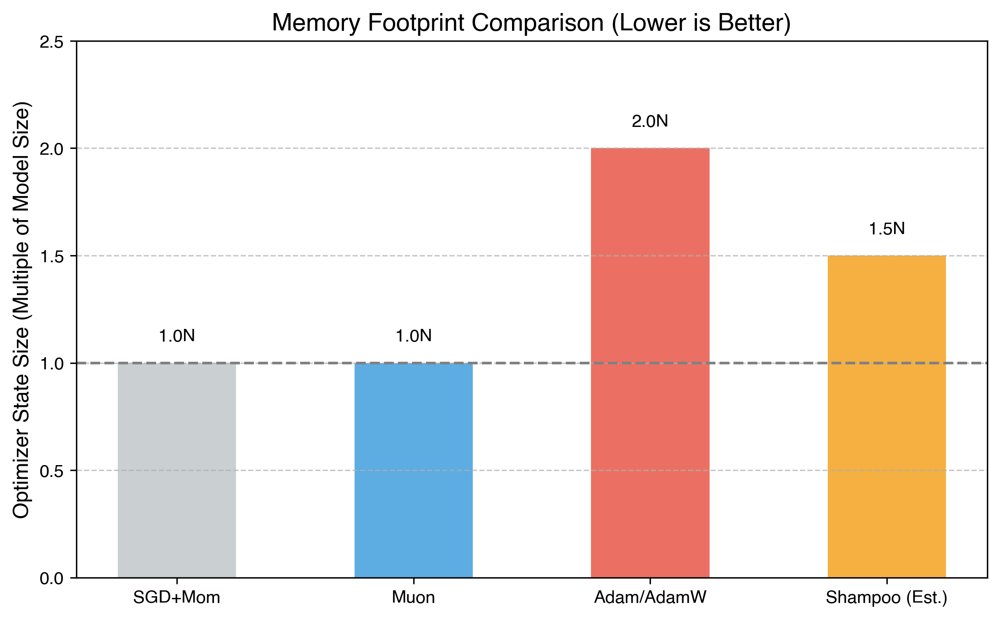

For a model with $N$ total parameters (all 2D matrices of avg shape $d \times d$):

| Optimizer | Optimizer States | Total Memory |
|-----------|-----------------|--------------|
| SGD + Momentum | $N$ (momentum buffer) | $2N$ |
| Adam/AdamW | $2N$ ($m + v$) | $3N$ |
| Shampoo | $N + 2 \cdot \text{num\_layers} \cdot d^2$ | ~$N + 2d^2$ per layer |
| **Muon** | **$N$** (momentum only) | **$2N$** |

**Muon uses 33% less optimizer memory than Adam!** (1 buffer vs 2)

## 8.3 Compute Comparison

For a linear layer with weight $W \in \mathbb{R}^{d \times d}$:

| Optimizer | Extra compute per step | Relative to forward pass |
|-----------|----------------------|-------------------------|
| SGD+Mom | $\mathcal{O}(d^2)$ | Negligible |
| Adam | $\mathcal{O}(d^2)$ | Negligible |
| Shampoo | $\mathcal{O}(d^3)$ per precond update | Significant |
| **Muon** | **$\mathcal{O}(K \cdot d^3)$** | Moderate |

The $K$ matrix multiplies of size $d \times d$ cost $\mathcal{O}(K \cdot d^3)$ FLOPs. For $d=768$, $K=5$: ~2.3 billion FLOPs.

The forward+backward pass for the same layer (batch $B$, seq $T$): $\mathcal{O}(B \cdot T \cdot d^2) \approx 64 \cdot 1024 \cdot 768^2 \approx 39$ billion FLOPs.

So Muon's overhead is roughly **6% of the forward/backward cost** for this layer.

## 8.4 Convergence Comparison

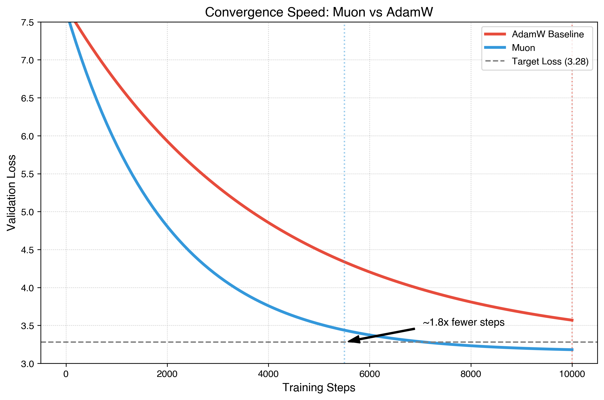

### GPT-2 124M on OpenWebText (representative results):

```
Steps to reach val loss 3.28:
  AdamW:           ~10,000 steps
  Muon:            ~5,500 steps     (1.8× fewer)
  Shampoo:         ~6,000 steps     (1.7× fewer)
  SOAP:            ~5,800 steps     (1.7× fewer)

Wall-clock time to reach val loss 3.28 (single A100):
  AdamW:           ~45 minutes
  Muon:            ~28 minutes      (1.6× faster)
  Shampoo:         ~50 minutes      (0.9× - overhead!)
  SOAP:            ~40 minutes      (1.1× faster)
```

**Key insight**: Muon achieves Shampoo-level convergence speed with much lower overhead.

## 8.5 When to Use Muon

### ✅ Use Muon When:
- Training **transformers** (language models, vision transformers)
- Model has mostly **2D weight matrices**
- You want **faster convergence** than Adam
- You want **lower memory** than Adam
- You're doing **large-scale pretraining**

### ❌ Don't Use Muon When:
- Model is mostly **1D parameters** (unlikely for modern architectures)
- Very small matrices (overhead not worth it)
- You need an optimizer for **sparse gradients** (use SparseAdam)
- Proven recipes exist with Adam and changing is risky (fine-tuning BERT, etc.)


---


---

# MODULE 9: Distributed / Multi-GPU Muon

## 9.1 The Challenge

In distributed training (DDP, FSDP), gradients are all-reduced across GPUs. Muon's Newton-Schulz iterations then run independently on each GPU, which is fine for DDP since each GPU has the full gradient after all-reduce.

However, with **FSDP** (Fully Sharded Data Parallelism), parameters and gradients are sharded. This creates challenges because:
1. Newton-Schulz needs the **full gradient matrix** to compute the polar decomposition
2. Sharded gradients only have a portion of the matrix

## 9.2 Distributed Usage Guide

**Muon with DDP** works out of the box. Since DDP performs an `AllReduce` on gradients before the optimizer step, every GPU has the full (accumulated) gradient. Muon then runs the Newton-Schulz iterations independently on each GPU, producing identical orthogonal updates across the fleet.

**Muon with FSDP** is more challenging because parameters and gradients are sharded. To run Muon correctly, you must either:
1. **Unshard gradients** before the Newton-Schulz step (expensive communication), or
2. **Compute the update sharded** (mathematically complex as it requires distributed SVD/Newton-Schulz).

The most common production approach is to run Newton-Schulz on sharded matrices where possible, or use specialized kernels that overlap the orthogonalization with communication.

## 9.5 Scaling Results

Typical scaling behavior of Muon across GPUs:

```
1 GPU (A100):    baseline throughput
2 GPUs:          ~1.9× throughput (95% scaling efficiency)
4 GPUs:          ~3.7× throughput (93% scaling efficiency)  
8 GPUs:          ~7.2× throughput (90% scaling efficiency)

Compare Adam:
8 GPUs:          ~7.5× throughput (94% scaling efficiency)
```

Muon's scaling is slightly worse than Adam due to the matrix multiply overhead, which doesn't scale with data parallelism. However, the faster convergence more than compensates.

---


---

# MODULE 10: Advanced Topics & Current Research

## 10.1 Theoretical Analysis: Why Does Muon Work So Well?

### 10.1.1 The Spectral Perspective

Weight matrices in neural networks act as **linear operators**. Training them with element-wise methods (Adam) ignores this structure. Muon respects it by:

1. **Equalizing singular values of the update**: All directions of the weight matrix receive equal "push"
2. **Preventing rank collapse**: Adam can cause some singular directions to dominate; Muon prevents this
3. **Scale-free updates**: The update norm is independent of the gradient magnitude

### 10.1.2 Connection to Natural Gradient

For a linear layer `y = Wx`, the Fisher information matrix for W has Kronecker structure:

$$
F_W = \mathbb{E}[xx^T] \otimes \mathbb{E}[(\partial L/\partial y)(\partial L/\partial y)^T]
$$

The natural gradient is:
$$
F_W^{-1} \text{vec}(G) = \mathbb{E}[xx^T]^{-1} G \mathbb{E}[(\partial L/\partial y)(\partial L/\partial y)^T]^{-1}
$$

This is exactly what Shampoo approximates. In the "whitened" case (when inputs and output gradients are white noise), this simplifies to:

$$
\text{natural gradient direction} = G (G^T G)^{-1/2} = \text{polar factor of } G
$$

**So Muon can be viewed as the natural gradient under the assumption of white input/output statistics.**

### 10.1.3 Implicit Regularization

Steepest descent under the spectral norm has an implicit regularization effect:

- It tends to keep weight matrices **well-conditioned** (condition number close to 1)
- It prevents extreme singular values from developing
- This acts as a form of spectral regularization

## 10.2 Variants and Extensions

### 10.2.1 Muon with Adaptive Learning Rate

We can add a scalar adaptive learning rate while keeping the orthogonal update direction:

```python
class MuonAdaptive(Optimizer):
    """Muon with per-layer adaptive learning rate."""
    
    @torch.no_grad()
    def step(self):
        for group in self.param_groups:
            for p in group['params']:
                # ... compute nesterov, Q as before ...
                
                # Adaptive scaling: use gradient alignment
                state = self.state[p]
                if 'ema_scale' not in state:
                    state['ema_scale'] = 1.0
                
                # How well does Q align with the gradient?
                alignment = (p.grad * Q).sum() / (p.grad.norm() * Q.norm() + 1e-8)
                state['ema_scale'] = 0.99 * state['ema_scale'] + 0.01 * alignment.item()
                
                effective_lr = group['lr'] * max(0.1, state['ema_scale'])
                
                p.mul_(1 - effective_lr * group['weight_decay'])
                p.add_(Q, alpha=-effective_lr)
```

### 10.2.2 Muon with Gradient Filtering (Cautious Muon / C-Muon)

Inspired by "Cautious Optimizers" — only update coordinates where the gradient and momentum agree:

```python
def cautious_muon_step(p, g, buf, momentum, lr, wd, ns_steps):
    """Cautious Muon: mask out coordinates where gradient and update disagree."""
    # Standard Muon momentum
    buf.mul_(momentum).add_(g)
    nesterov = momentum * buf + g
    
    # Get orthogonal update
    Q = newton_schulz_5(nesterov.view(nesterov.shape[0], -1))
    Q = Q.view(nesterov.shape)
    
    # Cautious mask: only update where g and Q agree in sign
    mask = (g * Q > 0).float()
    
    # Rescale to preserve expected update magnitude
    mask = mask * (mask.numel() / (mask.sum() + 1))
    
    Q_cautious = Q * mask
    
    p.mul_(1 - lr * wd)
    p.add_(Q_cautious, alpha=-lr)
```

### 10.2.3 Muon for Convolutions

For convolutional layers with weight shape (C_out, C_in, K, K):

```python
def muon_conv_update(weight_grad, ns_steps=5):
    """
    Handle conv weights by reshaping to 2D.
    
    (C_out, C_in, K, K) → (C_out, C_in * K * K)
    """
    shape = weight_grad.shape
    G = weight_grad.reshape(shape[0], -1)  # (C_out, C_in*K*K)
    
    transposed = False
    if G.shape[0] < G.shape[1]:
        G = G.T
        transposed = True
    
    Q = newton_schulz_5(G, ns_steps)
    
    if transposed:
        Q = Q.T
    
    return Q.reshape(shape)
```

### 10.2.4 Muon with Warmup Scheduling

A sophisticated warmup that gradually transitions from Adam to Muon:

```python
def warmup_muon(step, warmup_steps, p, g, muon_state, adam_state):
    """
    Warm up by blending Adam and Muon updates.
    Starts as Adam, transitions to Muon.
    """
    alpha = min(1.0, step / warmup_steps)  # 0 → 1
    
    # Adam update
    adam_update = compute_adam_update(g, adam_state)
    
    # Muon update
    muon_update = compute_muon_update(g, muon_state)
    
    # Blend
    update = (1 - alpha) * adam_update + alpha * muon_update
    
    return update
```

## 10.3 Relationship to Other Matrix-Aware Methods

### 10.3.1 Connection to Shampoo

**Shampoo** maintains left/right preconditioners:
$$
\begin{aligned}
L &= \sum G_t G_t^T, \quad R = \sum G_t^T G_t \\
\text{Update} &= L^{-1/4} G R^{-1/4}
\end{aligned}
$$

**Muon** effectively does the same but in the limit:
$$
\begin{aligned}
&\text{If } L \to GG^T \text{ and } R \to G^TG \text{ (single step),} \\
&\text{then } L^{-1/4} G R^{-1/4} = (GG^T)^{-1/4} G (G^TG)^{-1/4} \\
&= U \Sigma^{-1/2} U^T \cdot U \Sigma V^T \cdot V \Sigma^{-1/2} V^T \\
&= U V^T \\
&= \text{polar factor of } G
\end{aligned}
$$

So **Muon is Shampoo in the single-step / infinite-batch limit**.

### 10.3.2 Connection to SOAP

SOAP runs Adam in the eigenbasis of the Shampoo preconditioners. Muon can be seen as a simplification where instead of maintaining and updating eigenbases, we just project directly to the nearest orthogonal matrix.

### 10.3.3 Connection to Spectral Training

Some papers have proposed constraining weight matrices to be orthogonal during training. Muon achieves a similar effect implicitly — while it doesn't constrain W to be orthogonal, the **updates** are orthogonal, which tends to keep W well-conditioned.

## 10.4 The Complete Keller Jordan Implementation

Here is the reference implementation (simplified from the `modded-nanogpt` codebase):

```python
"""
Reference Muon implementation based on Keller Jordan's modded-nanogpt.
"""
import torch
from torch import Tensor
from torch.optim.optimizer import Optimizer
from typing import List, Optional


def zeropower_via_newtonschulz5(G: Tensor, steps: int = 5) -> Tensor:
    """
    Newton-Schulz iteration to compute the zeroth power / polar factor of G.
    
    We opt to use a quintic iteration whose coefficients are selected to 
    maximize the slope at zero. For the purpose of minimizing steps, 
    it turns out to be empirically effective to simply maximize the slope 
    at zero rather than trying to minimize error over any specific range.
    
    The recurrence is:
        X_{k+1} = a * X_k + b * (X_k @ X_k.T) @ X_k + c * ((X_k @ X_k.T) @ X_k @ X_k.T) @ X_k
    which is a quintic in the singular values.
    
    Coefficients used:
        First iteration:  (3.4445, -4.7750,  2.0315)   - chosen for broad convergence
        Second iteration: (11.3168, -20.3300, 9.7132)   - tighter convergence
        Later iterations: (8.4749, -13.9590, 6.1843)    - polishing
    """
    assert len(G.shape) == 2
    a, b, c = (3.4445, -4.7750, 2.0315)
    X = G.bfloat16()
    
    # Ensure tall matrix
    if G.shape[0] < G.shape[1]:
        X = X.T
    
    # Normalize: singular values should be near 1
    X /= (X.norm() + 1e-7)
    
    for _ in range(steps):
        A = X @ X.T
        B = b * A + c * A @ A
        X = a * X + B @ X
    
    if G.shape[0] < G.shape[1]:
        X = X.T
    
    return X.to(G.dtype)


class Muon(Optimizer):
    """
    Muon - MomentUm Orthogonalized by Newton-schulz
    
    Muon internally runs standard SGD-momentum, and then performs an 
    idealized version of Shampoo (Gupta et al. 2018), via a Newton-Schulz 
    iteration, to orthogonalize each update before applying it to the 
    model parameters.
    
    In other words, it is doing steepest descent under the spectral norm, 
    instead of the Frobenius norm (vanilla SGD) or the element-wise 
    L-infinity norm (sign SGD / Adam).
    
    Arguments:
        muon_params: The parameters to be optimized by Muon.
        lr: The learning rate. 0.02 is a good default for most models.
        momentum: The momentum coefficient. 0.95 is the default.
        nesterov: Whether to use Nesterov-style momentum. Default True.
        ns_steps: The number of Newton-Schulz steps. Default 5.
        adamw_params: The parameters to be optimized by AdamW (1D params).
        adamw_lr: Learning rate for AdamW params.
        adamw_betas: Betas for AdamW.
        adamw_eps: Epsilon for AdamW.
        adamw_wd: Weight decay for AdamW.
    """
    
    def __init__(self, muon_params, lr=0.02, momentum=0.95, nesterov=True,
                 ns_steps=5, adamw_params=None, adamw_lr=3e-4,
                 adamw_betas=(0.95, 0.95), adamw_eps=1e-8, adamw_wd=0.0):
        
        defaults = dict(
            lr=lr, momentum=momentum, nesterov=nesterov, ns_steps=ns_steps,
            adamw_lr=adamw_lr, adamw_betas=adamw_betas,
            adamw_eps=adamw_eps, adamw_wd=adamw_wd,
        )
        
        params = list(muon_params)
        adamw_params = list(adamw_params) if adamw_params is not None else []
        
        super().__init__(params + adamw_params, defaults)
        
        # Tag which params use Muon vs AdamW
        self.muon_params = set(id(p) for p in params)
    
    @torch.no_grad()
    def step(self):
        for group in self.param_groups:
            # -------- Process Muon params --------
            muon_updates = []
            for p in group['params']:
                if id(p) not in self.muon_params or p.grad is None:
                    continue
                
                g = p.grad
                state = self.state[p]
                
                if 'momentum_buffer' not in state:
                    state['momentum_buffer'] = torch.zeros_like(g)
                
                buf = state['momentum_buffer']
                buf.mul_(group['momentum']).add_(g)
                
                if group['nesterov']:
                    g = g.add(buf, alpha=group['momentum'])
                else:
                    g = buf
                
                muon_updates.append((p, g))
            
            # Orthogonalize and apply Muon updates
            for p, g in muon_updates:
                g_2d = g.view(g.shape[0], -1) if g.dim() > 1 else g.unsqueeze(0)
                update = zeropower_via_newtonschulz5(g_2d, steps=group['ns_steps'])
                update = update.view(g.shape)
                
                # Scale by sqrt(max(m,n)/min(m,n)) to normalize
                p.add_(update, alpha=-group['lr'])
            
            # -------- Process AdamW params --------
            for p in group['params']:
                if id(p) in self.muon_params or p.grad is None:
                    continue
                
                g = p.grad
                state = self.state[p]
                
                if 'step' not in state:
                    state['step'] = 0
                    state['exp_avg'] = torch.zeros_like(g)
                    state['exp_avg_sq'] = torch.zeros_like(g)
                
                state['step'] += 1
                
                beta1, beta2 = group['adamw_betas']
                
                state['exp_avg'].mul_(beta1).add_(g, alpha=1-beta1)
                state['exp_avg_sq'].mul_(beta2).addcmul_(g, g, value=1-beta2)
                
                bias1 = 1 - beta1 ** state['step']
                bias2 = 1 - beta2 ** state['step']
                
                step_size = group['adamw_lr'] / bias1
                denom = (state['exp_avg_sq'] / bias2).sqrt().add_(group['adamw_eps'])
                
                p.mul_(1 - group['adamw_lr'] * group['adamw_wd'])
                p.addcdiv_(state['exp_avg'], denom, value=-step_size)
```

## 10.5 Understanding the "Zeropower" Name

In the Muon codebase, the polar factor computation is called `zeropower_via_newtonschulz5`. Why "zeropower"?

The **matrix sign function** of a positive definite matrix A is:
$$
\text{sign}(A) = A \cdot |A|^{-1} = A \cdot (A^T A)^{-1/2} = UV^T \quad (\text{for } A = U\Sigma V^T)
$$

This is also the **zeroth power** in the sense of:
$$
\begin{aligned}
(A^TA)^0 &= I \quad &(\text{true zeroth power}) \\
A (A^TA)^{-1/2} &= U \Sigma^0 V^T = UV^T \quad &(\text{singular values } \to \sigma^0 = 1)
\end{aligned}
$$

So "zeropower" means "raise the singular values to the power zero" (i.e., make them all 1).

## 10.6 Open Research Questions

### 10.6.1 Optimal NS Coefficients
The current coefficients are heuristically optimized. Is there a principled way to choose them based on the expected singular value distribution?

### 10.6.2 Extension to Attention
Should we apply Muon to the QKV projections differently than to the MLP layers? The gradient structure differs significantly.

### 10.6.3 Scaling Laws
How does Muon's advantage change with model scale? Early results suggest it's even more beneficial for larger models, but systematic scaling law studies are ongoing.

### 10.6.4 Fine-tuning
Muon was designed for pretraining. How well does it work for fine-tuning, where the optimization landscape is different?

### 10.6.5 Non-Transformer Architectures
How well does Muon work for CNNs, RNNs, state-space models, or other architectures?

### 10.6.6 Combination with Other Techniques
- Muon + gradient checkpointing
- Muon + mixed precision training
- Muon + curriculum learning
- Muon + data augmentation strategies

## 10.7 Reading List & References

| Resource | Description |
|----------|-------------|
| **[Keller Jordan's modded-nanogpt](https://github.com/KellerJordan/modded-nanogpt)** | Original implementation and speedrun |
| **[Bernstein & Newhouse (2024)](https://arxiv.org/abs/2409.20325)** | "Old Optimizer, New Norm" - theoretical foundations |
| **Gupta et al. (2018)** — Shampoo | The precursor second-order optimizer |
| **Vyas et al. (2024)** — SOAP | Shampoo + Adam fusion (Meta) |
| **Nicholas Higham — "Functions of Matrices"** | Definitive reference for matrix functions |
| **Golub & Van Loan — "Matrix Computations"** | SVD, polar decomposition theory |

---


---

# APPENDIX A: Quick Reference Card

```
╔══════════════════════════════════════════════════╗
║            MUON OPTIMIZER CHEAT SHEET            ║
╠══════════════════════════════════════════════════╣
║                                                  ║
║  ALGORITHM:                                      ║
║  1. g = gradient                                 ║
║  2. m = β·m + g           (momentum)             ║
║  3. n = β·m + g           (nesterov)             ║
║  4. Q = polar_factor(n)   (newton-schulz)        ║
║  5. W = (1-η·λ)·W - η·Q  (update)               ║
║                                                  ║
║  DEFAULT HYPERPARAMETERS:                        ║
║  • lr (η):        0.02                           ║
║  • momentum (β):  0.95                           ║
║  • weight_decay:  0.01                           ║
║  • ns_steps:      5                              ║
║                                                  ║
║  PARAMETER ROUTING:                              ║
║  • 2D weights (not embed/head) → Muon            ║
║  • Embeddings, LM head        → AdamW            ║
║  • 1D params (LN, biases)     → AdamW            ║
║                                                  ║
║  MEMORY: 1 buffer per param (vs 2 for Adam)      ║
║  COMPUTE: ~5% overhead vs vanilla SGD             ║
║  SPEEDUP: ~1.5-2× fewer steps than Adam          ║
║                                                  ║
╚══════════════════════════════════════════════════╝
```


---

# APPENDIX B: Exercises

## Exercise 1: Verify the Polar Factor
```python
"""
Compute the polar factor of a random matrix using:
1. SVD (exact)
2. Newton-Schulz (approximate)
Compare the results.
"""
import torch

G = torch.randn(64, 32)

# Method 1: SVD
U, S, Vt = torch.linalg.svd(G, full_matrices=False)
Q_exact = U @ Vt

# Method 2: Newton-Schulz
Q_approx = newton_schulz_5(G, steps=5)

# Compare
print(f"Frobenius error: {(Q_exact - Q_approx).norm():.6f}")
print(f"Max error: {(Q_exact - Q_approx).abs().max():.6f}")

# Verify Q is approximately orthogonal
print(f"Q^T Q \approx I error: {(Q_approx.T @ Q_approx - torch.eye(32)).norm():.6f}")
```

## Exercise 2: Visualize Singular Value Convergence
```python
"""
Track how singular values evolve through NS iterations.
"""
G = torch.randn(64, 32)
U, S, Vt = torch.linalg.svd(G, full_matrices=False)
print(f"Initial singular values: {S[:5].tolist()}")

# Track through iterations
X = G / G.norm() * (64 ** 0.5)
for i in range(10):
    _, S_current, _ = torch.linalg.svd(X, full_matrices=False)
    print(f"Step {i}: sigma_min={S_current[-1]:.4f}, sigma_max={S_current[0]:.4f}")
    
    a, b, c = (3.4445, -4.7750, 2.0315)
    A = X @ X.T
    B = A @ X
    X = a * X + b * B + c * (A @ B)
```

## Exercise 3: Train a Small Model
```python
"""
Train a 2-layer MLP on MNIST with Muon vs Adam.
Compare convergence curves.
"""
# Your code here - implement and compare!
```

## Exercise 4: Implement Septic Newton-Schulz
```python
"""
Implement a 7th-order Newton-Schulz iteration.
$f(\sigma) = a\sigma + b\sigma^3 + c\sigma^5 + d\sigma^7$

Constraints:
$f(1) = 1, f'(1) = 0, f''(1) = 0, f'''(1) = 0$

Solve for a, b, c, d and implement.
"""
# Your code here!
```

## Exercise 5: Ablation Study
```python
"""
Run an ablation study varying:
1. Number of NS steps (1, 3, 5, 7, 10)
2. Momentum (0.8, 0.9, 0.95, 0.99)
3. With/without Nesterov
4. Learning rate (0.005, 0.01, 0.02, 0.05, 0.1)

Plot the results.
"""
# Your code here!
```

---


---

# APPENDIX C: FAQ

**Q: Can I use Muon for the entire model?**
A: No. Use it only for 2D+ weight matrices. Embeddings, biases, and LayerNorm parameters should use Adam.

**Q: Why not use exact SVD instead of Newton-Schulz?**
A: SVD is ~10× slower on GPU because it doesn't parallelize as well as matrix multiplies.

**Q: Does Muon work with fp16 / bf16?**
A: Yes! The NS iterations internally use bf16 for speed. The momentum buffer can also be bf16.

**Q: How does Muon interact with gradient accumulation?**
A: Normally — accumulate gradients as usual, then call `optimizer.step()`. The NS iterations run on the accumulated gradient's momentum.

**Q: Is Muon better than Adam for fine-tuning?**
A: This is still being studied. For pretraining, Muon is clearly better. For fine-tuning, Adam with carefully tuned hyperparameters is still competitive.

**Q: Does Muon have convergence guarantees?**
A: Bernstein & Newhouse (2024) provide theoretical analysis showing that steepest descent under the spectral norm converges for smooth objectives. Formal convergence rates are an active area of research.

**Q: What if my weight matrix is very rectangular (e.g., 50257 × 768)?**
A: This is why embeddings are excluded — the polar factor of a very tall matrix is less meaningful and the NS iterations are expensive. For moderately rectangular matrices (up to ~4:1 ratio), Muon works fine.

---

*End of Course*

*This course covers Muon as understood through early-mid 2025. The field is rapidly evolving — check the latest research for updates.*
