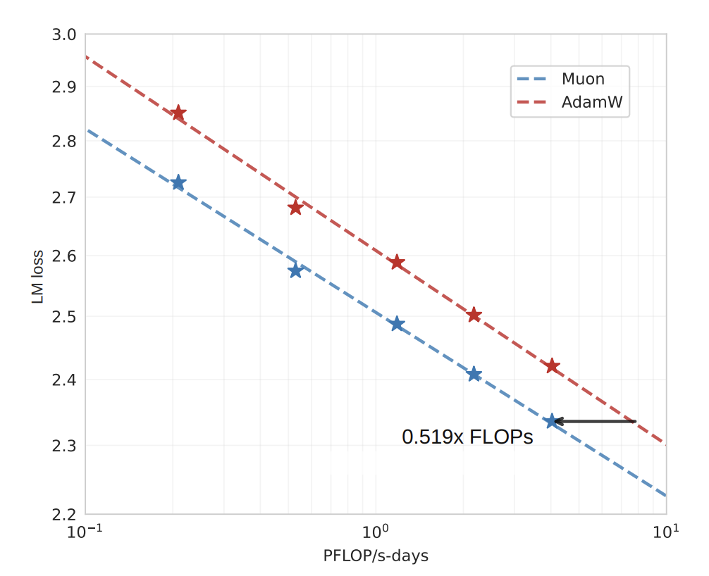
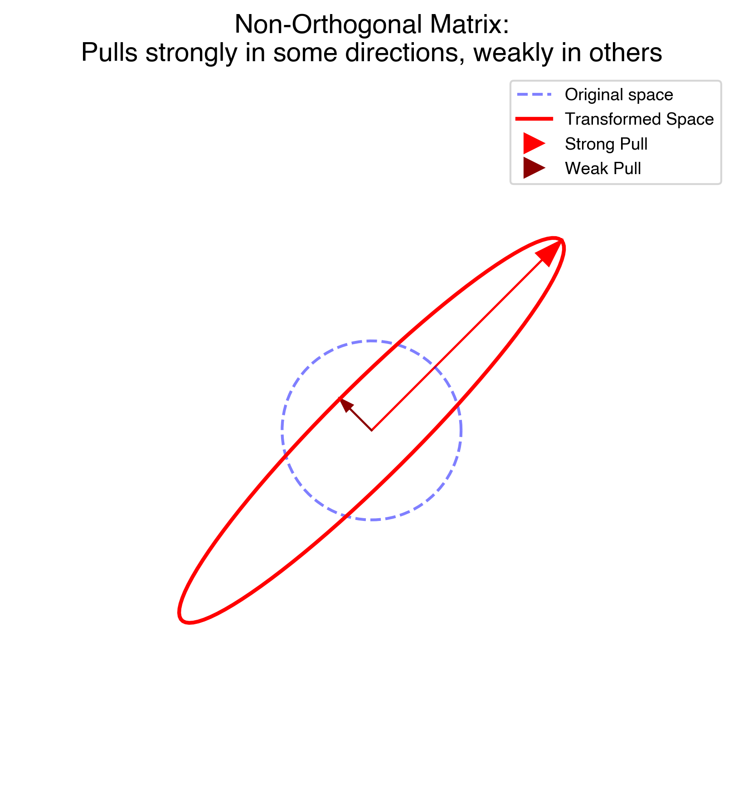
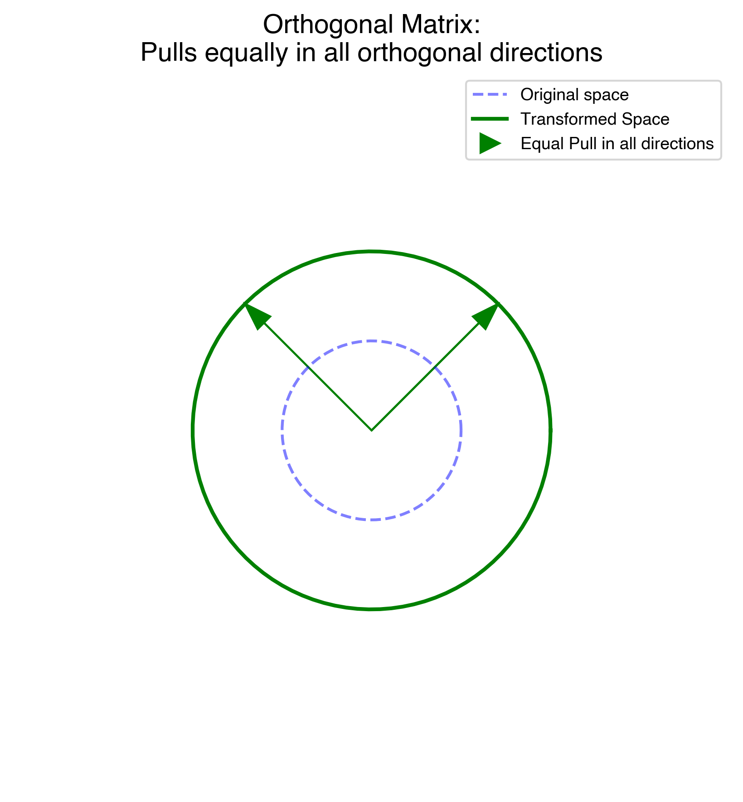

# STOP Using AdamW, EVERYONE Uses Muon Now

Everyone (OpenAI, Meta, DeepSeek, Moonshot AI,...) replaced AdamW with Muon optimizer to train their LLMs and neural networks.

DeepSeek researcher said that Muon optimizer was one of 2 biggest inventions in 2025.

If you train ANY neural network - you MUST try it!

It should make your training 30% to 2x faster!

### Evidence that Muon beats AdamW


*Faster LLM training.* [source](https://kellerjordan.github.io/posts/muon/)



*Muon is effective on large-scale LLMs.* [source](https://arxiv.org/pdf/2502.16982)

> For code & implementation scroll below.


# The main idea

Let's start with the basic formula for weight updates:

$$
\theta_{t+1} = \theta_t - \eta \cdot \nabla_{\theta} \mathcal{L}
$$

- $\theta_t$: Model parameters (all weights) at step $t$.
- $\theta_{t+1}$: Updated parameters after one training step.
- $\eta$: Learning rate (update step size).
- $\mathcal{L}$: Loss function.
- $\nabla_{\theta} \mathcal{L}$: Gradient of the loss with respect to parameters $\theta$.
- $t$: Optimization step index.

If we take a look at the gradients $\nabla_{\theta} \mathcal{L}$, this matrix is subtracted from weights - this is how neural network learns, however, this matrix might be ill-conditioned - some directions might have a strong "pull", while other directions might have a weak "pull".



A "direction" or a "pull" is a coordinated change across multiple weights. It controls an input→output pathway through a layer.

Example:
Let's say we are training a neural network - when it sees a lot of green color it should predict "grass", and when it sees a lot of circles, it should predict "wheels".

Due to different types of encoding images, it might turn out that green image gradients have very small singular values (0.01), while circle image gradients have larger singular values (100).

This means that neural network will learn the [green -> grass] pathway (prediction) A LOT SLOWER than the [circle -> wheels] pathway.

It's not that there is less data for green color or circles are more important, it's just about the way data is represented with numbers.

Muon optimizer solves this:




Muon optimizer will make all singular values equal to 1, so it will update / learn [green -> grass] pathway at the same speed as [circle -> wheels] pathway.

**IMPORTANT**: Use Muon only for 2D weight matrices. Do NOT use it for embeddings, biases, LayerNorms, or the final output head — use AdamW for those.


### Crucial distinction

Muon optimizer makes makes **weight update matrices** orthogonal, not the weight matrices.


# Code & Implementation

Find the original Muon code [here](https://github.com/KellerJordan/Muon/blob/master/muon.py)

My implementation below contains another improvement - [polar express](https://arxiv.org/abs/2505.16932). You may just use the original code from the link above or my implementation.

If you copy paste the code into your AI agent, it should automatically implement it.

```python
import torch

# Polar Express coefficients — each step uses different, pre-optimized (a, b, c).
# Each iteration: X ← a·X + (b·A + c·A²)·X  where A = X@Xᵀ
# For vanilla Newton-Schulz, replace with: coeffs_list = [(3.4445, -4.7750, 2.0315)] * 5
coeffs_list = [
    (8.156554524902461,  -22.48329292557795,   15.878769915207462),
    (4.042929935166739,  -2.808917465908714,    0.5000178451051316),
    (3.8916678022926607, -2.772484153217685,    0.5060648178503393),
    (3.285753657755655,  -2.3681294933425376,   0.46449024233003106),
    (2.3465413258596377, -1.7097828382687081,   0.42323551169305323),
]

@torch.compile()
def zeropower_polar_express(G: torch.Tensor, steps: int = 5) -> torch.Tensor:
    """Newton-Schulz iteration for matrix orthogonalization.
    
    Iteratively maps G → UV^T (its orthogonal factor) by converging
    all singular values to 1, without ever computing an expensive SVD.
    """
    X = G.bfloat16()
    
    # Algorithm assumes wide (rows ≤ cols) matrices — transpose tall ones
    transposed = X.size(-2) > X.size(-1)
    if transposed:
        X = X.mT
    
    # Normalize so largest singular value starts near 1
    X = X / (X.norm(dim=(-2, -1), keepdim=True) * 1.01 + 1e-7)
    
    # Newton-Schulz iterations — converges singular values to 1
    for a, b, c in coeffs_list[:steps]:
        A = X @ X.mT          # A = X Xᵀ  (cheap: small square matrix)
        X = a * X + (b * A + c * A @ A) @ X
    
    return X.mT if transposed else X


class Muon(torch.optim.Optimizer):
    """MomentUm Orthogonalized by Newton-Schulz (Muon).
    
    Designed for 2-D weight matrices (Linear layers, attention projections, etc.).
    Do NOT use for embeddings, biases, LayerNorms, or the final output head —
    use AdamW for those.
    """
    def __init__(self, params, lr: float = 0.02, momentum: float = 0.95,
                 weight_decay: float = 0.0):
        super().__init__(params, dict(lr=lr, momentum=momentum,
                                     weight_decay=weight_decay))

    @torch.no_grad()
    def step(self):
        for group in self.param_groups:
            for p in group["params"]:
                if p.grad is None:
                    continue
                
                # 1. Nesterov momentum buffer
                state = self.state[p]
                if "buf" not in state:
                    state["buf"] = torch.zeros_like(p.grad)
                buf = state["buf"]
                buf.lerp_(p.grad, 1 - group["momentum"])   # EMA toward current grad
                
                # 2. Form the Nesterov "look-ahead" gradient
                g = p.grad.lerp_(buf, group["momentum"])
                
                # 3. Orthogonalize: map gradient → UV^T (all singular values = 1)
                g = zeropower_polar_express(g.view(g.size(0), -1))
                g = g.to(p.dtype)                 # Cast back from bfloat16
                
                # 4. Weight decay (AdamW-style, decoupled)
                if group["weight_decay"] > 0:
                    p.mul_(1 - group["lr"] * group["weight_decay"])
                
                # 5. Scale for matrix rectangularity & apply update
                # max(1, ...) means we only scale UP for tall matrices, never down
                scale = max(1, p.size(-2) / p.size(-1)) ** 0.5
                p.add_(g.view_as(p), alpha=-group["lr"] * scale)
```

---

## Usage Example

Here's how to plug Muon into any model alongside AdamW:

```python
import torch
import torch.nn as nn

model = MyTransformer().cuda()

# Split parameters: Muon for 2-D weight matrices, AdamW for everything else
muon_params  = [p for p in model.parameters() if p.ndim == 2 and p.requires_grad]
adamw_params = [p for p in model.parameters() if not (p.ndim == 2 and p.requires_grad)]

optimizer_muon  = Muon(muon_params,  lr=0.02, momentum=0.95)
optimizer_adamw = torch.optim.AdamW(adamw_params, lr=3e-4, weight_decay=0.1)

# Training loop
for batch in dataloader:
    loss = model(batch)
    loss.backward()
    
    optimizer_muon.step()
    optimizer_adamw.step()
    
    optimizer_muon.zero_grad()
    optimizer_adamw.zero_grad()
```

> **Tip:** A simple `p.ndim == 2` filter correctly separates Linear weight matrices (2-D) from embeddings, biases, LayerNorm scales, and the output head — no manual layer-name matching needed.

---

## Key Implementation Tips

### Use a BIG Learning Rate
Unlike AdamW which typically uses `3e-4` or `6e-4`, Muon works best with much larger learning rates.
*   **Default:** Start with `0.02`.
*   **Range:** `0.01` to `0.05` is common.
*   Because the update is orthogonalized (all singular values forced to 1), the gradient magnitude is always bounded — it can't explode or vanish. You have full control over step size via `lr` alone.

### Parameter Routing
Muon is designed for **2-D weight matrices only** (Linear layers, attention projections, MLPs). Use AdamW for everything else: embeddings, biases, LayerNorm parameters, and the output head.

The `p.ndim == 2` filter in the usage example above handles this automatically.

### Compile It!
Newton-Schulz involves several matrix multiplications ($X X^\top$). Using `@torch.compile()` lets PyTorch fuse these into a single GPU kernel.

### Scaling the LR by Matrix Shape
The update is scaled by $\sqrt{\max(1,\; \text{rows} / \text{cols})}$. This compensates for the "rectangularity" of the weight matrix. The `max(1, ...)` means we only scale *up* for tall matrices but never scale *down* for wide ones, keeping the effective step size consistent across all layer shapes.